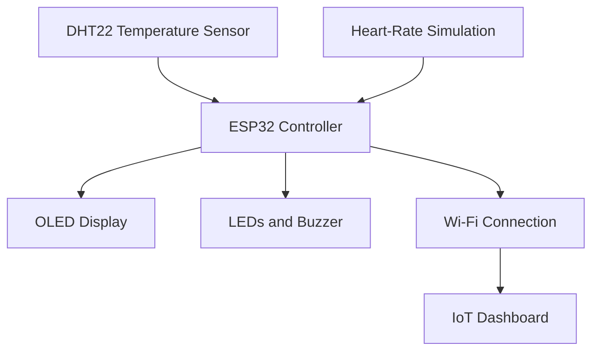

# System Architecture

## 1. Architecture overview

The Medical Monitoring System uses an ESP32 as its central controller. It collects temperature and simulated heart-rate data, evaluates the measurements, displays the current status, activates alarms, and sends data to an IoT dashboard through Wi-Fi.

## 2. System block diagram

## 3. Component responsibilities

| Component | Responsibility |
|---|---|
| ESP32 | Read sensor data, evaluate thresholds, control outputs and manage Wi-Fi communication |
| DHT22 | Provide simulated environmental temperature measurements |
| Potentiometer | Provide an adjustable analog value to simulate heart rate |
| SSD1306 OLED | Display temperature, heart rate and system status |
| Green LED | Indicate that all measurements are within the configured ranges |
| Red LED | Indicate an abnormal measurement |
| Buzzer | Generate an audible alarm during an abnormal condition |
| Wi-Fi connection | Transfer measurements from the ESP32 to the dashboard |
| IoT dashboard | Display current measurements, history and recorded events |

## 4. GPIO assignment

| Component | Signal | ESP32 pin |
|---|---|---:|
| DHT22 | Data | GPIO 15 |
| Potentiometer | Analog output | GPIO 34 |
| SSD1306 OLED | SDA | GPIO 21 |
| SSD1306 OLED | SCL | GPIO 22 |
| Green LED | Digital output | GPIO 25 |
| Red LED | Digital output | GPIO 26 |
| Buzzer | Digital output | GPIO 27 |

## 5. Data flow

1. The DHT22 provides a temperature measurement.
2. The potentiometer provides an analog value representing heart rate.
3. The ESP32 converts and evaluates the input values.
4. The OLED displays the measurements and current system status.
5. The ESP32 activates the green LED when all values are normal.
6. The ESP32 activates the red LED and buzzer when a value is abnormal.
7. The ESP32 sends measurements and events to the dashboard through Wi-Fi.
8. The dashboard displays the latest values and measurement history.

## 6. Operating states

| State | Condition | System response |
|---|---|---|
| Initializing | System is starting | Initialize sensors, display and Wi-Fi |
| Normal | All values are within their configured ranges | Green LED on, red LED and buzzer off |
| Alarm | At least one value is outside its configured range | Red LED and buzzer on, green LED off |
| Sensor error | A measurement cannot be read | Display an error and record the event |
| Connection error | Wi-Fi or dashboard connection is unavailable | Continue local monitoring and retry the connection |

## 7. Design considerations

- GPIO 34 is used as an analog input for the potentiometer.
- GPIO 21 and GPIO 22 provide the default ESP32 I²C connection for the OLED.
- The monitoring functions shall continue locally if the Wi-Fi connection fails.
- Alarm thresholds shall be configurable in the firmware.
- The architecture is designed for simulation and educational demonstration.
- The prototype is not a certified medical device.